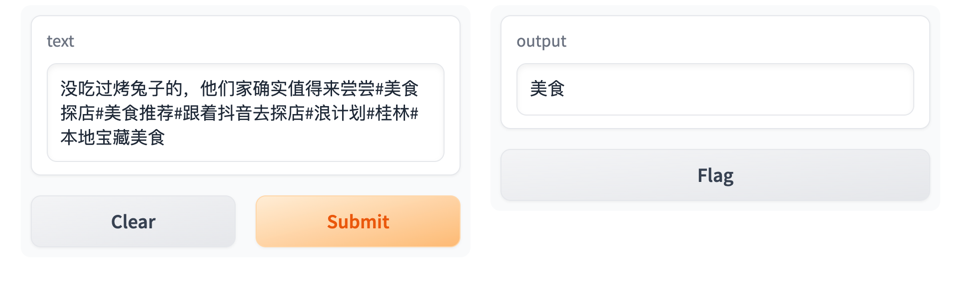
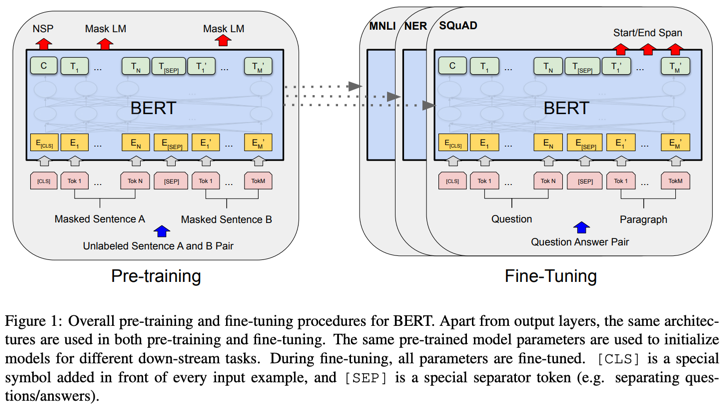
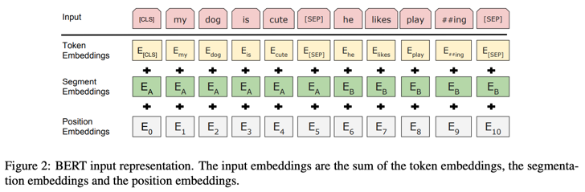

# 第二届七牛云1024创作节 文本分类模型
 **Team：`不想起名`**

使用「视频标题 + Tag」的文本进行分类，有如下类别：

- 宠物 
- 知识 
- 解说 
- 游戏 
- 娱乐 
- 二次元 
- 音乐 
- 美食 
- 体育 
- 时尚


## 效果


## API
使用 `gradio` 库进行搭建，代码位于 `./predict.py`

### Usage
#### Input Payload
```json
{
  "data": [
    "hello world"
  ]
}

```
#### Response Object
```json
{
    "data": [
      "string", 
    ],
    "duration": (float)
}

```

### Example
#### Python3
```python
import requests

response = requests.post("http://10.60.96.141:7675/run/predict", json={
	"data": [
		"hello world",
	]
}).json()

data = response["data"]
```
#### JavaScript
```javascript
const response = await fetch("http://10.60.96.141:7675/run/predict", {
    method: "POST",
    headers: { "Content-Type": "application/json" },
    body: JSON.stringify({
        data: [
            "hello world",
        ]
    })
});

const data = await response.json();
```

## 数据集
爬取抖音的搜索结果，每个类别 `100` 条
```text
THUCNews
├── data
│   ├── class.txt
│   ├── dev.txt
│   ├── test.txt
│   └── train.txt
└── saved_dict
    └── README.md
```


## 训练
使用 Bert 进行微调训练，代码位于 `./train_eval.py`

# 模型简介
出自论文 「BERT: Pre-training of Deep Bidirectional Transformers for
Language Understanding」，链接：https://arxiv.org/pdf/1810.04805.pdf



其中：

- Token Embeddings是词向量，第一个单词是CLS标志，可以用于之后的分类任务
- Segment Embeddings用来区别两种句子，因为预训练不光做LM还要做以两个句子为输入的分类任务
- Position Embeddings和之前文章中的Transformer不一样，不是三角函数而是学习出来的

# 鸣谢
代码来源于：Bert-Chinese-Text-Classification-Pytorch
[](https://github.com/996icu/996.ICU/blob/master/LICENSE)

中文文本分类，Bert，ERNIE，基于pytorch，开箱即用。

## 对应论文
[1] BERT: Pre-training of Deep Bidirectional Transformers for Language Understanding  
[2] ERNIE: Enhanced Representation through Knowledge Integration  
